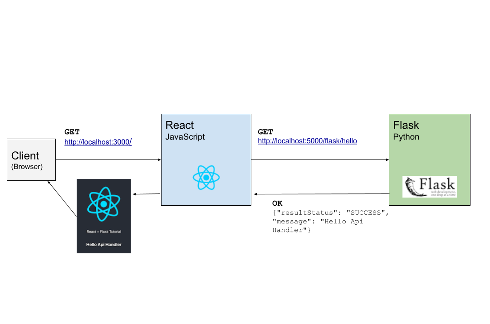
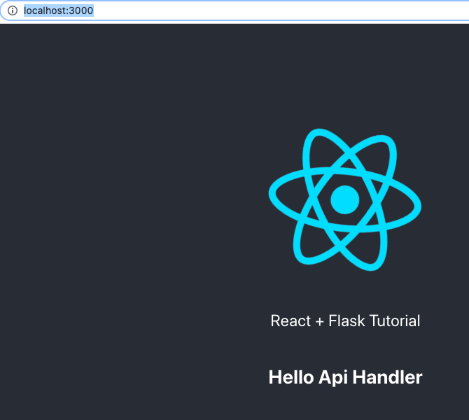

# Flask - React tutorial
Folliwing the tutorial [How To Build & Deploy a React + Flask App] (https://towardsdatascience.com/build-deploy-a-react-flask-app-47a89a5d17d9) by 
Ran (Reine)

The backend, i.e., the API uses Flask and the frontend uses React.  

It's deployed to Heroku.  

There are at least 3 branches:

1. `local` for local development
2. `deploy` for deploying to Heroku
3. and `main`, which is the upstream branch

## Basic architecture



## Let's start with the backend
For this we'll create a simple Flask app.  
We start with `pyenv global 3.6.3`.

The important files here are:  

* [app.py](./app.py) - Entrypoint
* [api/HelloApiHandler.py ](api/HelloApiHandler.py) - API Controller
* [requirements.txt](./requirements.txt)- Python dependencies list

After having installed Flask (`pip install -r requirements.txt`) and having the places of this project in place, we can test our API.

The following command starts a server in localhost.

```
$ flask run
```

Then we can test the API with something like this

```
$ curl -X GET http://127.0.0.1:5000/flask/hello 
{"resultStatus": "SUCCESS", "message": "Hello Api Handler"}
```


## Then let's go to the frontend
The work folder for the frontend is `frontend`. There is a React project there that was created using `npx create-react-app`.  

From the `frontend` directory, we start the frontend with `npm start`.
We should be able to see a screen like the following in [http://localhost:3000/](http://localhost:3000/).




## Finally we are deployig to Heroku
For this step we use the `deploy` branch.  
We'll be deploying adding the Heroku Git remote to our project.  

Once it is set up, we need to build our frontend project from the `frontend` folder with `npm run build`. This will generate a folder `build`, in normal situations this would be built somewhere else, like Heroku but for simplicity, we'll just add our build folder and push it to the Git remote of Heroku.  

And that is it!!  
The project is deployed at [https://flask-react-tutorial-sep-2021.herokuapp.com/](https://flask-react-tutorial-sep-2021.herokuapp.com/)


### References
* [How To Build & Deploy a React + Flask App] (https://towardsdatascience.com/build-deploy-a-react-flask-app-47a89a5d17d9) by Ran (Reine)

* [Flask send_from_directory returns 404 for certain filenames](https://stackoverflow.com/questions/65171961/flask-send-from-directory-returns-404-for-certain-filenames) in Stack Overflow

* [Heroku Help - How to Switch branches](https://help.heroku.com/O0EXQZTA/how-do-i-switch-branches-from-master-to-main)

